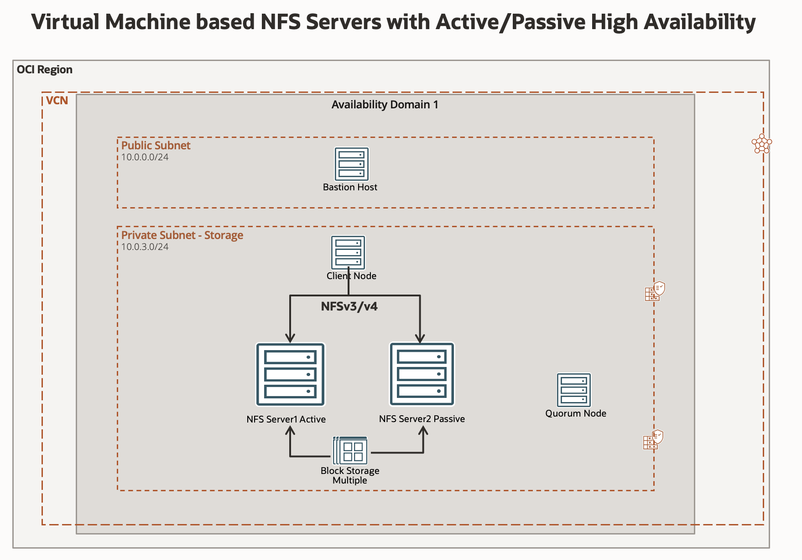
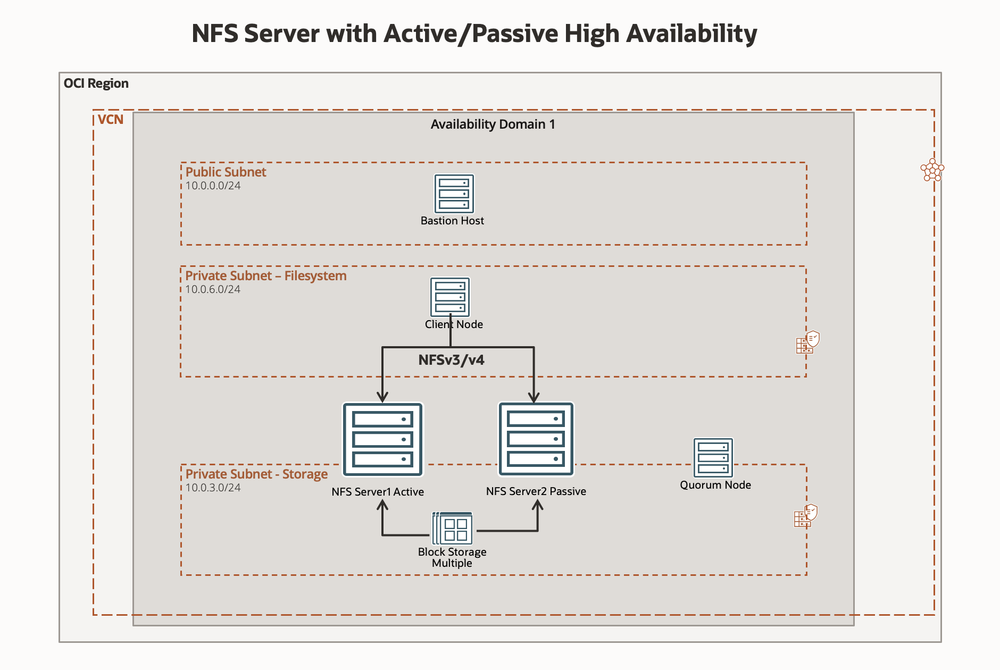
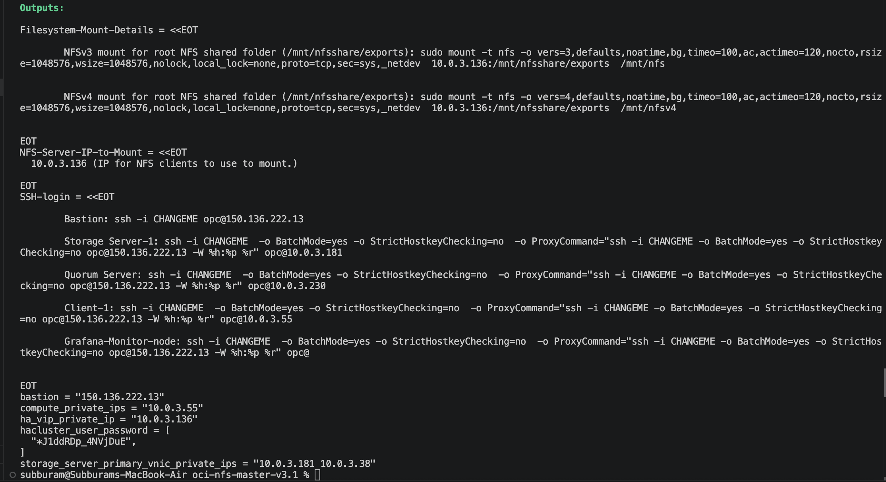
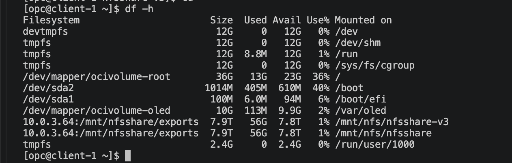

# oci-nfs

oci-nfs template is a solution to deploy NFS server in an active/passive High Availability (HA) cluster. For NFS with HA, the solution provisions two NFS servers and one Quorum node. For HA, the solution utilizes open source corosync/pacemaker cluster services along with corosync qdevice for quorum on Quorum node. OCI's Shared (Multi-attach) Block Volume Storage saves 50% in storage cost versus traditional DRBD (Distributed Replicated Block Device) replication across 2 servers for high availability. The solution also allows you to deploy a singe node NFS server,  using either local NVMe SSDs or network attached Block volumes.  Optionally,  with the template, you can deploy NFS client nodes too.   

OCI NFS solution supports both NFSv3 and NFSv4.   

[Bare metal Standard (BM.Standard* )compute nodes](https://docs.oracle.com/en-us/iaas/Content/Compute/References/computeshapes.htm#baremetalshapes__bm-standard) come with 2 physical NICs (2x25Gbps or 2x50Gbps). To get best performance,  network bandwidth of both NICs can be used by creating 2 private subnets.  One subnet (private-storage) is used for data transfer between NFS server and OCI Block Volumes (disks) and second subnet (private-fs) is used for data transfer between NFS clients and NFS server.   

HA Stonith Fencing:  We use SBD (Split Brain Detection) fencing agent to protect the cluster against split brain and data corruption. SBD fencing requires a shared disk (different from NFS data disks)  attached to both NFS server nodes.  The template provisions the fencing shared disk and configures it. 

Quorum Node:  Using just 2 nodes in production is not recommended, since it has limitations. A minimum of 3 nodes are required to maintain quorum, especially when one of the node fails or gets network isolated from other nodes.  We can use a VM with 1 or 2 OCPU.
 

| Resource Type | Mandatory |         Resource Count         | Resource Details  |  Comments |
| :---: | :---: | :---: | :--- | :--- | 
| NFS Servers: Compute | Yes |  2   | BM.Standard4.Ax.120 (2 × 100 Gbps physical NICs). It is the newest current x86 bare-metal standard shape that retains two physical NICs. Current alternatives: BM.Standard3.64 or BM.Standard.E4.128 (2 × 50 Gbps). BM.Standard.E5.192 and BM.Standard.E6.256 provide 100/200 Gbps respectively, but each has one physical NIC. VMs are supported where bare-metal performance and physical NIC separation are not required; use VM.Standard.E6.Flex sized for workload.  | NFS HA cluster - min/max: 2.|
| Quorum Node: Compute | Yes |  1  | Compute shape with 1 or 2 Core (OCPU). VM.Standard2.1/2.2/.E2.1/.E2.2  |  | 
| Stonith SBD Fencing Disk: OCI Block Volumes (/dev/oracleoci/oraclevdb) | Yes |  1  | Shared Disk - Multi-attach Block Volume is attached to both NFS Server nodes.  |  |
| Data Volumes:  OCI Block Volumes | Yes |  Max: 31  | HA solution: Shared Disk/Multi-attach Data Block Volume are attached to both NFS Server nodes.  Create a Volume Group of all Data Volumes and an LVM using the Volume Group with Striping.  Maximum LVM capacity: 31x32TB = 992TB.  Each Data Volume Capacity: min: 50GB, Max: 32TB. | NFS HA cluster - min:1 , max: 31.|
| Client Node: Compute | No |  min:0  | Recommend provisioning 1 client node to test mounting of the filesystem.  For production, select compute shape based on performance requirements.  | |
| Bastion Node: Compute | Yes |  1  | VM.Standard2.2 is the default shape for Bastion.  | |


## Architecture
Given below are various high level architecture for NFS deployment. 

### Virtual Machines - Active/Passive NFS Server in a High Availability Cluster


    
### Bare metal Nodes - Active/Passive NFS Server in a High Availability Cluster
Bare metal nodes comes with 2 physical NICs (2x25Gbps). To get best performance,  network bandwidth of both NICs can be used by creating 2 private subnets.  One subnet (private-storage) is used for data transfer between NFS server and OCI Block Volumes (disks) and second subnet (private-fs) is used for data transfer between NFS clients and NFS server.   




## Prerequisites

### 1. OCI Dynamic Group and Policies for active/passive high availability NFS cluster
The below two requirements are only applicable if you plan to deploy an active/passive high availability NFS cluster.  You must authorize instances to call services in Oracle Cloud Infrastructure.


     1. Create a dynamic group of compute instances in your compartment (OCI console > Identity > Dynamic Groups).  For more documentation, refer to https://docs.cloud.oracle.com/en-us/iaas/Content/Identity/Tasks/callingservicesfrominstances.htm.  Once instances are provisioned,  the dynamic group can be further restricted to only include the instance_id of the 2 NFS servers. 

 ```
               ANY {instance.compartment.id =  'compartment.ocid'}
 ```

     2. Create policies to authorize dynamic group to use vnics, subnets and private-ips APIs.

```
             Allow dynamic-group nfs_high_availability to use private-ips in compartment <your compartment>

             Allow dynamic-group nfs_high_availability to use vnics in compartment <your compartment>

	         Allow dynamic-group nfs_high_availability to use subnets in compartment <your compartment>

```

### 2. Existing VCN/Subnets
If you plan to deploy in an **existing VCN & subnets**, then allow TCP & UDP traffic for the 2 private subnets (in case of Baremetal NFS server or in one private subnet (in case of NFS server using VMs). Add below rules to allow all TCP and UDP traffic within VCN CIDR range or for the 2 private subnets. 

```
        Ingress Rule: Stateless: No, Source: VCN_CIDR ,  IP Protocol: TCP ,  Leave other fields empty/default.  
        Ingress Rule: Stateless: No, Source: VCN_CIDR ,  IP Protocol: UDP ,  Leave other fields empty/default.  
        Egress Rule: Stateless: No, Destination: 0.0.0.0/0 ,  IP Protocol: All Protocols  ,  Leave other fields empty/default.  
```


## Resource Manager Deployment
This Quick Start uses [OCI Resource Manager](https://docs.cloud.oracle.com/iaas/Content/ResourceManager/Concepts/resourcemanager.htm) to make deployment easy, sign up for an [OCI account](https://cloud.oracle.com/en_US/tryit) if you don't have one, and just click the button below:

[](https://console.us-ashburn-1.oraclecloud.com/resourcemanager/stacks/create?region=home&zipUrl=https://github.com/oracle-quickstart/oci-nfs/raw/master/orm/dist/nfs.zip)


## Marketplace Deployment 
If you prefer to use a GUI console to deploy, you can use the Markeplace listing to deploy: [NFS Server in an active/passive high availability cluster](https://cloudmarketplace.oracle.com/marketplace/en_US/listing/82147253)

## Terraform Deployment
If you prefer Terraform, then follow the below steps.  

1. First off you'll need to do some pre deploy setup.  That's all detailed [here](https://github.com/oracle/oci-quickstart-prerequisites).

2. Now, you'll want a local copy of this repo.  You can make that with the commands:

```
git clone https://github.com/oracle-quickstart/oci-nfs.git
cd oci-nfs/
ls
```

### Customize the template 
Create a terraform.tfvars file and set values as per your needs.  We recommend to use terraform.tfvars to override values in variables.tf file.   

```
cat terraform.tfvars
# NFS topology. Creates a two-node active/passive HA NFS cluster, a quorum
# node, a bastion, and three 500-GB high-performance filesystem volumes.
use_custom_name  = false
ad_number        = 0
linux_os_version = "8.10"
cluster_name     = "localtestingnfs"

persistent_storage_server_shape = "VM.Standard2.2"
storage_server_ocpus            = 2
storage_server_memory           = 16

# Three shared data volumes provide 1.5 TB raw filesystem capacity. HA also
# creates one separate small SBD fencing volume; it is not filesystem storage.
fs1_disk_count = 3
fs1_disk_size  = 500

# Set client_node_count above zero to create test client instances.
create_compute_nodes = true
client_node_count    = 1
client_node_shape    = "VM.Standard2.24"
mount_point = "/mnt/nfs"
create_monitoring_server = false


```


### Deployment and Post Deployment
Deploy using standard Terraform commands

```
terraform init
terraform plan
terraform apply 
```



### Filesystem mounted on clients 


### How to mount NFS-HA filesystem on HPC compute nodes
#### Edit the following variables in /etc/ansible/hosts
	- add_nfs=true
	- nfs_target_path=/nfs/nfsha
	- nfs_source_IP=172.x.x.x
	- nfs_source_path=/mnt/nfsshare/exports
	- nfs_options= "vers=3,defaults,noatime,bg,timeo=100,ac,actimeo=120,nocto,rsize=1048576,wsize=1048576,nolock,local_lock=none,proto=tcp,sec=sys,_netdev"


